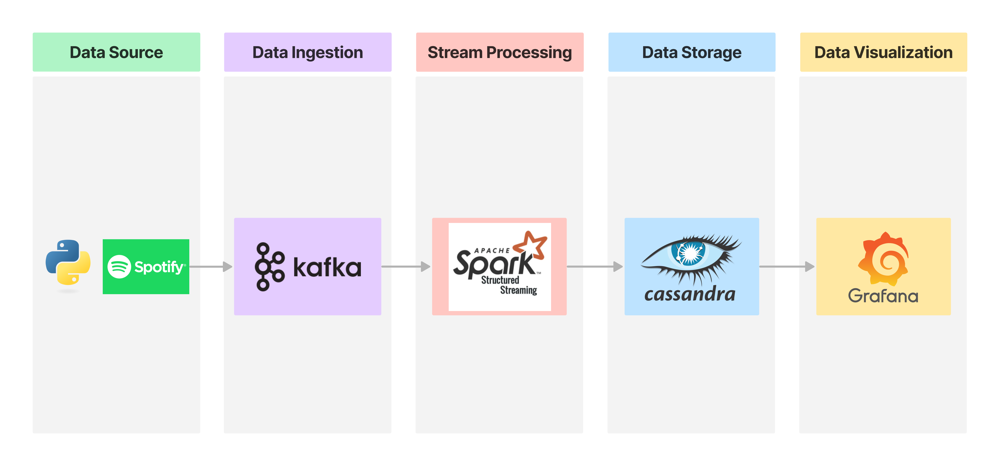
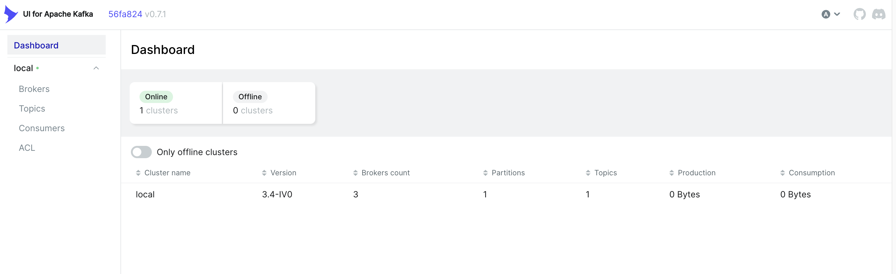
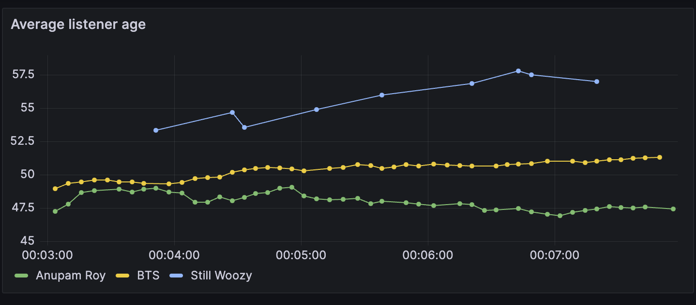

# Fake Streaming Pipeline

This project is designed to simulate a real-time data pipeline.

It generates real time fake data like user and song in Spotify, sends this data as a stream through a Kafka server, processes the data in real-time using PySpark([Structured Streaming](https://spark.apache.org/docs/latest/structured-streaming-programming-guide.html)), writes the processed data to a Cassandra database and visualize the results in Grafana.

The simulation includes data for the user (such as name, address, age, and nationality), the song being played (including artist, album name, track name, track duration, and genre), and the time of play.

The data processing includes selecting certain fields, transforming some of the data, and computing the average age of listeners for each artist.

## Table of Contents

- [Fake Streaming Pipeline](#fake-streaming-pipeline)
  - [Table of Contents](#table-of-contents)
  - [Structure](#structure)
  - [Why Fake Data?](#why-fake-data)
    - [Benefits](#benefits)
  - [Getting Started](#getting-started)
    - [Prerequisites](#prerequisites)
    - [Installation](#installation)
  - [Usage](#usage)
    - [How to](#how-to)
  - [Data Processing Details](#data-processing-details)
  - [Roadmap](#roadmap)
  - [Acknowledgments](#acknowledgments)
    - [Projects](#projects)
    - [Libraries](#libraries)
    - [Dataset](#dataset)

## Structure



## Why Fake Data?

In a real-world scenario, you would likely have a consistent stream of data coming from a source such as a web app, IoT devices, or logs. However, setting up such a source for the purpose of demonstrating or testing a data pipeline can be challenging, especially when you want a large volume of data. You might not have access to enough real data, or there could be privacy issues with using real user data.

This is why Faker comes in. [Faker](https://github.com/joke2k/faker) is a Python library that generates fake data. You can use it to generate data that mimics a variety of real-world data types. By using Faker, you can easily generate a large volume of realistic-looking data for your data pipeline.

### Benefits

- Control over the volume of data

    You can generate as much or as little data as you need, simply by running the Faker function more or fewer times.

- Privacy

    Since the data is all fake, there are no privacy concerns.

- Variety

    Faker can generate a wide range of data types, allowing you to simulate a wide range of real-world scenarios.

- Consistency

    The data generated by Faker is consistent in format, making it easier to process.

## Getting Started

This project is set up to run in a dockerized environment, making it easy to get up and running.

### Prerequisites

Before starting, ensure you have the following installed:

- Python 3.10
- Pipenv
- Docker and Docker Compose

### Installation

1. Clone the repository and run the following command

    ```bash
    git clone https://github.com/OZOOOOOH/Fake-Streaming-Pipeline.git

    cd Fake-Streaming-Pipeline
    ```

2. Set up Python virtual environment

    2-1. Install all necessary dependencies

    ```bash
    pipenv install
    ```

    2-2. Activate the new virtual environment

    ```bash
    pipenv shell
    ```

3. Start Docker containers

    ```bash
    docker-compose up -d
    ```

4. Run the application

    ```bash
    python src/main.py
    ```

## Usage

If you follow above descriptions, You can monitor the Kafka server and the Cassandra database to see the data in real-time. You can also query the Cassandra database to analyze the processed data.

### How to

To monitor the [Kafka server](http://localhost:8080)



To watch the grafana [dashboard](http://localhost:3000/d/e555ae2e-ab3b-45f6-a269-9ac98133ca5f/listener-average-age?orgId=1&refresh=5s)


## Data Processing Details

Class [SpotifyStreamingProcessor](https://github.com/OZOOOOOH/Fake-Streaming-Pipeline/blob/main/src/process.py) in process.py reads the data from the Kafka stream, processes it, and writes it to Cassandra.

The processing involves selecting certain fields, transforming some of the data, and computing the average listener age for each artist.
The processed data and the average age of listeners by artist are then written to Cassandra.

## Roadmap

- [ ] Add Batch Processing Pipelines
- [ ] Enhance the structure of the application to handle larger volumes of data.
- [ ] Adapt the application to run on cloud services such as AWS.
- [ ] Implement a batch processing pipeline.
- [ ] Extend the application to handle data from multiple sources.
- [ ] Monitor cassandra and kafka containers using grafana

## Acknowledgments

### Projects

- [Reddit Sentiment Analysis Data Pipeline
](https://github.com/nama1arpit/reddit-streaming-pipeline)
- [Finnhub Streaming Data Pipeline
](https://github.com/RSKriegs/finnhub-streaming-data-pipeline)

### Libraries

- [kafka-python](https://github.com/dpkp/kafka-python)
- [Faker](https://github.com/joke2k/faker)

### Dataset

- [🎹 Spotify Tracks Dataset](https://www.kaggle.com/datasets/maharshipandya/-spotify-tracks-dataset)
- [Awesome Public Streaming Datasets](https://github.com/ColinEberhardt/awesome-public-streaming-datasets)
